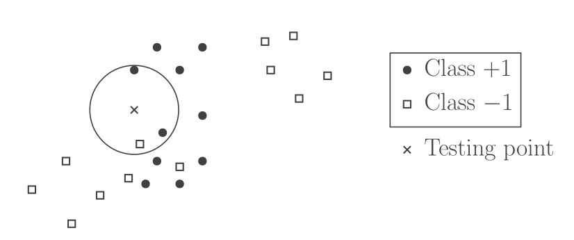
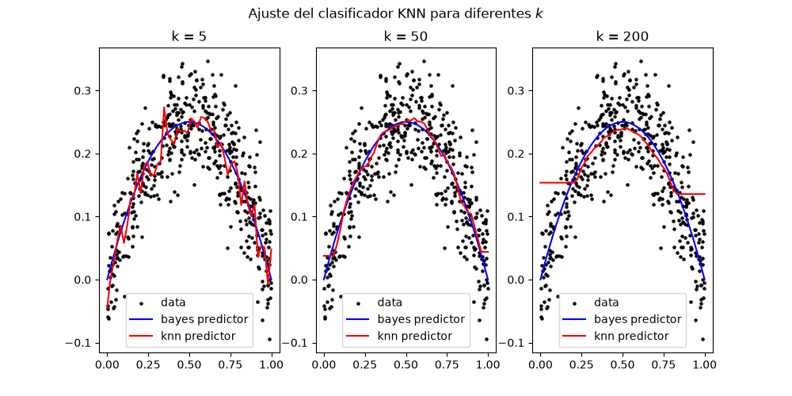
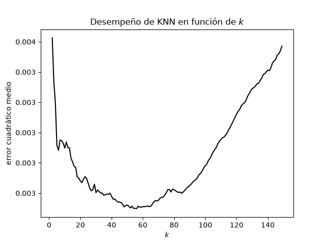

::: {.content-hidden}

:::

# Introducción al curso

## Resumen

El curso busca desarrollar herramientas para la modelación matemática de problemas de ingeniería. En particular, se estudiarán problemas del análisis de datos, así como herramientas computacionales con las que estos se resuelven.

## Metodología

- Se realizarán clases de cátedra durante ~3 meses.
- Luego de esto, se da lugar al proyecto final.

## Evaluaciones

- Dos tareas a lo largo del semestre (50%).
- Proyecto final (50%).

## Código {.smaller}

Existen múltiples lenguajes/librerías/plataformas en las cuales se implementan los algoritmos de análisis y aprendizaje que veremos en este curso:

- `pytorch` (`python`)
- `tensorflow` (`python`)
- `scikit-learn` (`python`)
- `SciML` (`julia`)
- `R`
- `Fabric` / `Azure ML` / `Excel` (`Microsoft`)

Para intenciones pedagógicas, no se utilizará ninguna de estas librerías especializadas. Ya que mucha atención a los detalles de cada paquete puede distraer de la idea nuclear de los algoritmos.

Se preferirá un repositorio de `python` construido dedicadamente para hacer legibles los algoritmos, sacrificando algo de rendimiento que no necesitamos aún.

# Introducción al Aprendizaje Supervisado

## El problema central de este curso

::: {.callout-tip}
## Problema de Aprendizaje Supervisado

Dada una colección finita de *observaciones*  $\{ (x_i, y_i) \}_{i=1}^n \subseteq \mathcal{X} \times \mathcal{Y}$ y un nuevo $x \in \mathcal{X}$, predecir su correspondiente $y \in \mathcal{Y}$.
:::

Aquí, es común que a los $x_i$ se les llame *entradas / características* y a los $y_i$ se es llame *salidas / etiquetas*.

::: {.callout-note}
## Nota

Obsérvese lo muy poco matemático que es este problema en su forma original.

:::

Normalmente tomaremos $\mathcal{X} = \mathbb{R}^d$ con $d$ grande (pensar $10^6$), e $\mathcal{Y} = \mathbb{R}$ o $\{ 0, 1 \}$ o $\{ 1, \dots, k \}$.

## Desafíos de este problema {.smaller}

- La correspondencia $y = f(x)$ puede no ser una función en el sentido clásico (determinista). Ya sea por ambigüedad en la clasificación o variables no observadas.
- El modelo de predicción $f$ puede ser muy complejo (e.g. Redes neuronales) o incluso difícil de definir (e.g. Modelos de Lenguaje).
- La escasez de buenos datos es común en aplicaciones.
- La maldición de la dimensionalidad: Un $\mathcal{X}$ de dimensión muy grande puede introducir problemas.
- La data con la que trabajamos y la data de aplicación pueden ser muy diferentes.
- El criterio con el que se obtiene el predictor $f$ puede ser difícil de definir.

## ¿Cómo formalizamos esto? {.smaller}

La forma más común de formular matemáticamente este problema es *probabilista*. Es decir, se asume que los datos $\{ (x_i, y_i) \}_{i=1}^n$ son realizaciones de una misma variable aleatoria (es decir, son i.i.d.) y que su distribución es la misma en datos de *entrenamiento* y *validación*.

Lo que haremos será entonces resolver problemas del tipo
$$
    \min_f\; \mathbb{E}[l(y, f(x))] .
$$ {#eq-generic-unsupervised-learning-problem}

::: {.callout-tip}

## Definición: Algoritmo de aprendizaje

Dados los elementos de este problema bien definidos, un *algoritmo de aprendizaje* es una función que dado el conjunto de datos $\{ (x_i, y_i) \}_{i=1}^n$, entrega la función resultante $f$ que resuelve  @eq-generic-unsupervised-learning-problem.

:::


## Conjuntos de datos

En análisis de datos, es importante distinguir:

- **Datos de entrenamiento (training):** Con respecto a los cuales se obtiene el predictor $f$.
- **Datos de validación (validation):** Con los que se fijan *hiperparámetros* del proceso de entrenamiento.
- **Datos de evaluación (testing):** Con los que se reporta el desempeño final del modelo escogido (solo se utilizan una vez!).

## ¿De qué me sirve aprender la teoría?

El proceso de aplicar un método de aprendizaje supervisado también se *debuguea* más allá de la programación misma. Se debe escoger un buen modelo entre varias opciones, fijar hiperparámetros correctamente y saber identificar causas de lo que podría ser un mal ajuste.

Es valioso saber cuándo vale la pena utilizar cada método y por qué podría estar no dando los resultados esperados.

# Preliminares teóricos

## Límites teóricos

Cuando la correspondencia entrada / salida no es determinista pero se busca un predictor $f$ que sí lo es, existen límites a lo que es posible lograr, aún con recursos computacionales infinitos. Estudiaremos estos antes de introducir detalles de implementación.

Sea $p(x, y)$ la distribución de datos en $\mathcal{X} \times \mathcal{Y}$ con distribución marginal $p(x)$ en $\mathcal{X}$.

## Función de pérdida

Consideremos una función $l: \mathcal{Y} \times \mathcal{Y} \to \mathbb{R}$ en que $l(y, z)$ es el costo de predecir $z$ cuando la respuesta correcta es $y$. Algunos ejemplos son:

- **Clasificación binaria:** $\mathcal{Y} = \{ 0, 1 \}$, $l(y, z) = \boldsymbol{1}_{y \neq z}$. A esto se le llama *pérdida 0-1*.
- **Clasificación multicategoría:** $\mathcal{Y} = \{ 1, \dots, k \}$, $l(y, z) = \boldsymbol{1}_{y \neq z}$.
- **Regresión:** $\mathcal{Y} = \mathbb{R}$, $l(y, z) = |y - z|^p$ ($p \in \{ 1, 2 \}$, pérdida *cuadrática* o *absoluta*).

## Riesgo esperado

Dada la función de pérdida $l$ y la distribución $p$, podemos definir:

::: {.callout-tip}
## Definición: Riesgo esperado

Dada una función de predicción $f: \mathcal{X} \to \mathcal{Y}$, una función de pérdida $l : \mathcal{Y} \times \mathcal{Y} \to \mathbb{R}$ y una distribución de probabilidad $p$ sobre $\mathcal{X} \times \mathcal{Y}$, el *riesgo esperado* de $f$ se define por
$$
    \mathcal{R}(f) = \mathbb{E} \left[ l(y, f(x)) \right] = \int_{\mathcal{X} \times \mathcal{Y}} l(y, f(x)) \; \mathrm{d} p(x, y).
$$
A veces, esto se denota por $\mathcal{R}_{p}(f)$.

:::

## Riesgo empírico

Cuando se cuenta con una colección de datos, es posible estimar el riesgo esperado mediante promedios:

::: {.callout-tip}
## Definición: Riesgo empírico

Dada una función de predicción $f: \mathcal{X} \to \mathcal{Y}$, una función de pérdida $l: \mathcal{Y} \times \mathcal{Y} \to \mathbb{R}$ y datos $\{ (x_i, y_i) \}_{i=1}^n$, el riesgo empírico de $f$ se define por
$$
    \hat{\mathcal{R}}(f) = \frac{1}{n} \sum_{i=1}^n l(y_i, f(x_i)).
$$
:::

::: {.callout-warning}
## Ejercicio

Describa el riesgo esperado para los problemas de clasificación binaria, multicategoría y regresión con sus respectivas pérdidas asociadas.
:::

## Predictor de Bayes

Utilizando ley de esperanza total, el riesgo esperado se puede escribir como
$$
    \mathcal{R}(f) = \int_{\mathcal{X}} r(f(x') | x') \; \mathrm{d}p(x'),
$$
en que
$$
    r(z | x' ) = \mathbb{E}[l(y, z) | x = x'].
$$
Esto sugiere escoger $f(x')$ de manera óptima para cada $x'$ fijo.

## Predictor de Bayes {.smaller}

::: {.panel-tabset}

### Proposición

:::{.callout-note}
## Proposición: Predictor de Bayes

El riesgo esperado se minimiza en un predictor $f_*: \mathcal{X} \to \mathcal{Y}$ conocido como *predictor de Bayes*, que satisface:
$$
\begin{align*}
\forall x' \in \mathcal{X} : f_*(x') &\in \argmin_{z \in \mathcal{Y}} \mathbb{E}[l(y, z) | x=x'] \\
&= \argmin_{z \in \mathcal{Y}} r(z |x').
\end{align*}
$$
El *riesgo de Bayes* es el valor mínimo y se define por
$$
    \mathcal{R}^* = \mathbb{E}_{x' \sim p} \left[ \inf_{z \in \mathcal{Y}} r(z | x') \right].
$$
Podemos definir también el *riesgo marginal* de un predictor $f$ como
$$
    \mathcal{R}(f) - \mathcal{R}^* \geq 0.
$$
:::

### Demostración

Dada $f$, tenemos
$$
\begin{align*}
\mathcal{R}(f) - \mathcal{R}^* &= \mathcal{R}(f) - \mathcal{R}(f_*) \\
&= \int_{\mathcal{X}} \left[ r(f(x') | x') - \min_{z \in \mathcal{Y}} r(z | x') \right] \; \mathrm{d}p(x') \\
&\geq 0.
\end{align*}
$$
:::

## Ejercicio: Predictor de Bayes en clasificación binaria

::: {.panel-tabset}

### Ejercicio

Describa el predictor de Bayes $f_*: \mathcal{X} \to \mathcal{Y} = \{ 0, 1 \}$ para el caso del problema de clasificación binaria con pérdida 0-1. Obtenga también una fórmula para el riesgo de Bayes y una condición bajo la cual $\mathcal{R}^* = 0$.

### Solución

A desarrollar.

:::

## Ejercicio: Predictor de Bayes en problema de regresión {.smaller .scrollable}

::: {.panel-tabset}

### Ejercicio

1. Sea $a \in \mathbb{R}$ constante e $y$ variable aleatoria. Pruebe la ley de varianza total
$$
    \mathbb{E}[(y - a)^2] = \text{var}(y) + \left( \mathbb{E}[y] - a \right)^2.
$${#eq-total-variance-law}
2. Pruebe que en el problema de regresión ($\mathcal{Y} = \mathbb{R}$) con pérdida cuadrática, el predictor de Bayes está dado por la esperanza condicional
$$
    f_*(x') = \mathbb{E}[y | x = x'].
$$

### Solución

1. Vemos que
$$
\begin{align*}
\text{var}[y] + \left( \mathbb{E}[y] - a \right)^2 &= \mathbb{E}[y^2] - \mathbb{E}[y]^2 + \mathbb{E}[y]^2 - 2a \mathbb{E}[y] + a^2 \\
&= \mathbb{E}[y^2 - 2ay + a^2] \\
&= \mathbb{E}[(y - a)^2].
\end{align*}
$$
2. Esto se puede ver usando (1), ya que el riesgo condicional es dado por
$$
\begin{align*}
r(z|x') &= \mathbb{E}[(y - z)^2 | x=x'] \\
&= \mathbb{E}[ (y - \mathbb{E}[y | x=x'])^2 | x=x'] + (z - \mathbb{E}[y | x=x'])^2.
\end{align*}
$$
Minimizar esto con respecto a $z$ se reduce entonces solo a estudiar el segundo término, el cual se minimiza en
$$
    z^* = f_*(x') = \mathbb{E}[y | x = x'].
$$

:::

# Aprendiendo de datos

## Idea {.smaller}

Si bien el predictor de Bayes es el óptimo teórico y pareciera trivializar el problema de aprendizaje, en la práctica nunca se tiene acceso a la distribución $p$, sino que se debe trabajar exclusivamente a partir de los datos $(x_i, y_i)$, donde obtener el predictor de Bayes para un $x'$ no observado no es posible.

Los algoritmos se clasifican en dos ideas principales:

- Promedios locales ($k$ vecinos más cercanos)
- Minimización de riesgo empírico (regresión logística, de mínimos cuadrados...)

Hacemos a continuación un resumen de ambas clases.

## Promedios locales {.smaller}

Estos son algoritmos que buscan aproximar directamente el predictor de Bayes $f_*(x') = \mathbb{E}[y | x = x']$ (o $f_*(x') = \argmax_{z \in \mathcal{Y}} \mathbb{P}[y = z | x = x']$ en el caso binario) desde los datos empíricos. Esto suele requerir algún tipo de promedio local al encontrar datos que no tienen etiqueta, pero cercanos a datos etiquetados.

Por ejemplo, tómese el clasificador de los *$k$ vecinos más cercanos* (KNN). En que $\mathcal{Y} = \{ \pm 1 \}$ y dadas las observaciones $((x_i, y_i))_{i=1}^{n}$ y un nuevo $x^{\text{test}}$, este se clasifica por voto mayoritario entre sus $k$ vecinos más cercanos.



## Balance del algoritmo KNN

| Ventajas | Desventajas |
| :--- | :--- |
| No hay entrenamiento | La inferencia es costosa |
| Implementación sencilla | Maldición de la dimensionalidad |
| En dimensión baja puede tener buen desempeño | Depende de la función distancia que se escoja |
|  | El valor $k$ es un hiperparámetro a elegir |

## Minimización de riesgo empírico {.smaller}

Aquí, la estrategia es diferente. Se considera una familia parametrizada de funciones de predicción (modelos):
$$
f_{\theta}: \mathcal{X} \to \mathcal{Y}, \qquad (\theta \in \Theta)
$$
(Aquí $\Theta$ es subconjunto de un e.v.)

Se busca entonces minimizar el riesgo empírico con respecto a $\theta$:
$$
    \hat{\mathcal{R}}(f_\theta) = \frac{1}{n} \sum_{i=1}^n l(y_i, f_\theta(x_i)).
$$
De aquí, se obtiene un estimador $\hat{\theta} = \argmin_{\theta \in \Theta} \hat{\mathcal{R}}(f_\theta)$ y una función de predicción $f_{ \hat{\theta} }$.

## Ejemplo (mínimos cuadrados lineal) {.smaller}

Podemos tomar $l(y, z) = (y - z)^2$ y
$$
    f_{\theta}(x) = \theta^{\top} \phi(x)
$$
en que $\phi : \mathcal{X} \to \mathbb{R}^d$ es una función preestablecida (función de características). Esto define el riesgo empírico:
$$
    \frac{1}{n} \sum_{i=1}^n (y_i - \theta^{\top}\phi(x_i))^2,
$$
cuya minimización es un problema convexo. Otros ejemplos de modelos incluyen redes neuronales u otras aproximaciones no lineales.

# Vecinos más cercanos

## Ejemplo ilustrativo

A continuación, hacemos una regresión de vecinos más cercanos donde estimamos la función
$$
    f(x) = x\cdot(1 - x)
$$
en base a datos $x_i$ de distribución uniforme en $[0, 1]$ y datos $y_i$ obtenidos con una perturbación gaussiana.

## Código

```{.python}
import numpy as np
from scipy.stats import uniform, norm
from matplotlib import pyplot as plt

from mla.knn import KNNRegressor

# Data de validación
f = lambda x : x * (1 - x)
x = np.linspace(0, 1, num=50)
y = f(x)

# Data de entrenamiento
x_train = uniform.rvs(0, 1, size = 500)
y_train = f(x_train) + norm.rvs(size=500, scale=0.05)

d = lambda x,y : np.abs(x - y)

# Crear y evaluar modelos para diferentes k
K = [5, 50, 200]
models = [KNNRegressor(k=k, distance_func=d) for k in K]
Y = []
for model in models:
    model.fit(x_train, y_train)
    Y.append(model.predict(x))

```


## Resultados

{#fig-knn-simulation}

## Resultados

{#fig-knn-mse}

## El valor del ingeniero matemático

Mirando la @fig-knn-mse, se nos ocurre que sería útil obtener (o más bien estimar) la curva descrita. En términos matemáticos, dado $x \in \mathcal{X}$, buscamos una cota para
$$
    \mathbb{E}\left[ (\hat{f}(x) - f_*(x))^2 \; | \; x_1, \dots, x_n \right].
$$
La dependencia de esta cota con respecto a $k$ puede servir como heurística para elegir buenos valores en la práctica.

::: {.callout-warning}
### Nota

Pero no todo son resultados concretos! Este ejercicio también nos sirve para comprender el tipo de problemas en que KNN tiene sentido como predictor.
:::

## Marco general {.smaller}

El algoritmo KNN es parte de un marco más general donde los predictores son una combinación lineal de las etiquetas observadas con pesos dependientes de la entrada:
$$
    \hat{f}(x) = \sum_{i=1}^n \hat{w}_i(x) y_i.
$$
En el caso de KNN, sea $\Delta$ una distancia en $\mathcal{X}$ y, dada una observación $x \in \mathcal{X}$, ordenamos las entradas $x_i$ de modo que
$$
    \Delta(x_{i_1(x)}, x) \leq \Delta(x_{i_2(x)}, x) \leq \dots \leq \Delta(x_{i_n(x)}, x).
$$
El algoritmo KNN define entonces
$$
    \hat{w}_i(x) = \begin{cases}
        \frac{1}{k}, & i \in \{ i_1(x), \dots, i_k(x) \}, \\
0, & i \notin \{ i_1(x), \dots, i_k(x) \}.
    \end{cases}
$$

## Hipótesis para el análisis

Para simplificar, hacemos dos hipótesis que pueden ser debilitadas considerablemente

1. **Ruido acotado:** Existe $\sigma \geq 0$ tal que
$$
    \left( y - \mathbb{E}[y \; | \; x] \right)^2 \leq \sigma^2, \text{ c.s.}
$$
2. **Regularidad del modelo:** La función $f_{*}(x) = \mathbb{E}[y\; | \; x]$ es $B$-Lipschitz con respecto a la distancia $\Delta$.

## Obtención de la cota general {.smaller .scrollable}

::: {.panel-tabset}


### Resultado

Bajo las hipótesis anteriores, podemos obtener la siguiente cota para el error cuadrático medio:
$$
    \mathbb{E}[ (\hat{f}(x) - f_*(x))^2 \;|\; x_1, \dots, x_n] \leq B^2 \sum_{i=1}^n \hat{w}_i(x) \Delta(x_i, x)^2 + \sigma^2 \sum_{i=1}^n  \hat{w}_i(x)^2.
$$
El primer término representa el sesgo del estimador, mientras que el segundo representa su varianza.

### Derivación

Para descomponer el MSE entre sesgo y varianza, se utiliza la ley de varianza total (ver @eq-total-variance-law)
$$
\begin{align*}
& \mathbb{E}\left[ (\hat{f}(x) - f_*(x))^2 \;|\; x_1, \dots, x_n \right] \\
=& \left( \mathbb{E}[\hat{f}(x) \;|\; x_1, \dots, x_n] - f_*(x) \right)^2 + \text{var}[\hat{f}(x) \;|\; x_1, \dots, x_n] \\
=& \mathbb{E}[\hat{f}(x) - f_*(x) \;|\; x_1, \dots, x_n]^2 + \sum_{i=1}^n \hat{w}_i(x)^2 \mathbb{E}[(y_i - \mathbb{E}[y | x_i])^2 \;|\; x_i]
\end{align*}
$$
El término bajo la primera esperanza se puede escribir como sigue
$$
\begin{align*}
&\hat{f}(x) - f_*(x) \\
=& \sum_{i=1}^n y_i \hat{w}_i(x) - \mathbb{E}[y \;|\; x] \\
=& \sum_{i=1}^n \hat{w}_i(x) \left[ y_i - \mathbb{E}[y \;|\; x_i] \right] + \sum_{i=1}^n \hat{w}_i(x) \left[ \mathbb{E}[y \;|\; x_i] - \mathbb{E}[y \;|\; x] \right] \\
=& \sum_{i=1}^n \hat{w}_i(x) \left[ y_i - \mathbb{E}[y \;|\; x_i] \right] + \sum_{i=1}^n \hat{w}_i(x) \left[ f_*(x_i) - f_*(x) \right].
\end{align*}
$$
Nótese que el primer término tiene esperanza nula al condicionar a los $x_i$, mientras que el segundo término es determinista. Obtenemos entonces una expresión que podemos acotar mediante las hipótesis:
$$
\begin{align*}
& \mathbb{E}\left[ (\hat{f}(x) - f_*(x))^2 \;|\; x_1, \dots, x_n \right] \\
=& \left[ \sum_{i=1}^n \hat{w}_i(x) \left[ f_*(x_i) - f_*(x) \right] \right]^2 + \sum_{i=1}^n \hat{w}_i(x)^2 \mathbb{E}[(y_i - \mathbb{E}[y | x_i])^2 \;|\; x_i] \\
\leq & \left[ \sum_{i=1}^n \hat{w}_i(x) B \Delta(x_i, x) \right]^2 + \sigma^2 \sum_{i=1}^n \hat{w}_i(x)^2 \\
\leq & B^2 \sum_{i=1}^n \hat{w}_i(x) \Delta(x_i, x)^2 + \sigma^2 \sum_{i=1}^n \hat{w}_i(x)^2. \\
\end{align*}
$$
La última desigualdad se tiene por desigualdad de Jensen, por convexidad de la función $x \mapsto x^2$. Esto es lo que se buscaba obtener.

:::

## Caso de KNN {.smaller .scrollable}

Reemplazando los $\hat{w}_i(x)$ para el algoritmo de KNN, se obtiene la cota
$$
\begin{align*}
    \mathbb{E}[ (\hat{f}(x) - f_*(x))^2 \;|\; x_1, \dots, x_n] &\leq \sigma^2 \sum_{i=1}^n  \hat{w}_i(x)^2 + B^2 \sum_{i=1}^n \hat{w}_i(x) \Delta(x_i, x)^2 \\
&= \sigma^2 k \cdot \left( \frac{1}{k^2} \right) + B^2 \frac{1}{k}\sum_{j=1}^{k} \Delta(x_{i_j(x)}, x)^2 \\
&= \frac{\sigma^2}{k} + \frac{B^2}{k} \sum_{j=1}^{k} \Delta(x_{i_j(x)}, x)^2 .
\end{align*}
$$
El último término corresponde al promedio empírico de los cuadrados de las distancias entre $x$ y sus $k$ vecinos más cercanos. Buscamos ahora acotar esto en términos de los datos del problema.

::: {.callout-warning}
### Nota

Este es prácticamente un problema de matemática pura.

:::

## Lemas de distancia esperada {.smaller}

:::{.callout-note}

### Lema 1: Distancia esperada al vecino más cercano

Considere $n+1$ puntos $x_1, \dots, x_{n+1}$ obtenidos de una distribución de probabilidad con soporte compacto $\mathcal{X} \subseteq \mathbb{R}^d$. Entonces, el valor esperado del cuadrado de la distancia $l_{\infty}$ entre $x_{n+1}$ y su vecino más cercano está acotada por
$$
    4 \frac{\text{diam}(\mathcal{X})^2}{n^{ \frac{2}{d} }}.
$$
:::

:::{.callout-note}
### Lema 2: Distancia esperada al $k$-ésimo vecino más cercano
Bajo las hipótesis anteriores, el valor esperado del cuadrado de la distancia $l_{\infty}$ entre $x_{n+1}$ y su $k$-ésimo vecino más cercano está acotada por
$$
    8 \text{diam}(\mathcal{X})^2 \left( \frac{2k}{n} \right)^{ \frac{2}{d} }.
$$
:::

## Conclusión {.smaller}
$$
    \mathbb{E}[ (\hat{f}(x) - f_*(x))^2 \;|\; x_1, \dots, x_n] \leq \frac{\sigma^2}{k} + 8B^2 \text{diam}(\mathcal{X})^2 \left( \frac{2k}{n} \right)^{ \frac{2}{d}}.
$$

- Al aumentar los vecinos $k$, el la varianza decrece pero el sesgo aumenta.
- A mayor dimensionalidad, se introduce mayor sesgo (tener en mente que $\frac{k}{n} \ll 1$). Esto se conoce como *la maldición de la dimensionalidad* y en las próximas clases veremos métodos para mitigarla.

# Regresión lineal de mínimos cuadrados

## Introducción

La regresión lineal, pese a sonar simple, es una herramienta tremendamente poderosa, flexible y bien entendida por la teoría. La utilizaremos como un ejemplo insigne que captura muchos de los balances propios del aprendizaje automático moderno.

## Problema de mínimos cuadrados {.smaller}

Volviendo al aprendizaje supervisado, supongamos que disponemos de observaciones $(x_i, y_i) \in \mathcal{X} \times \mathcal{Y}, (i=1, \dots, n)$. Dado un nuevo $x \in \mathcal{X}$, buscamos predecir su correspondiente $y \in \mathcal{Y}$ con una función $f$ tal que $y \approx f(x)$.

Para regresión, tomamos $\mathcal{Y} = \mathbb{R}$ y la función de pérdida $l(y, z) = (y - z)^2$. Ya sabemos que el predictor óptimo es $f_*(x) = \mathbb{E}[y | x]$, pero no podemos evaluar esto de manera exacta solo con datos.

La regresión de mínimos cuadrados consiste en la categoría (nueva en este curso) de métodos de *minimización de riesgo empírico*. Dada una familia parametrizada de funciones $f_\theta: \mathcal{X} \to \mathcal{Y} = \mathbb{R}$, en que $\theta \in \Theta$ es un parámetro, se minimiza la cantidad
$$
    \frac{1}{n}\sum_{i=1}^n (y_i - f_\theta(x_i))^2.
$$
Con esto, se obtiene un minimizador $\hat{\theta}$ (aleatorio!!) y el predictor óptimo $f_{ \hat{\theta}}$.

## Caso de mínimos cuadrados lineal {.smaller .scrollable}

Tomemos en esta clase el caso en que la función $(x, \theta) \mapsto f_\theta(x)$ es lineal en $\theta$ y por lo tanto $\Theta = \mathbb{R}^d$ para algún $d$.

::: {.callout-warning}

### Nota

Esto no significa ser lineal en $x$.

:::

Tenemos entonces la forma
$$
    f_\theta(x) = \sum_{i=1}^{d} \alpha_i(x) \theta_i.
$$
Esto requiere $d$ funciones ya dadas $\alpha_i : \mathcal{X} \to \mathbb{R}$ las cuales podemos agrupar en un vector
$$
    \phi(x) = (\alpha_1(x), \dots, \alpha_d(x)),
$$
de donde
$$
    f_\theta(x) = \phi(x)^{\top}\theta.
$$
Se minimiza entonces el riesgo empírico
$$
    \hat{\mathcal{R}} = \frac{1}{n} \sum_{i=1}^n (y_i - \phi(x_i)^{\top} \theta)^2.
$$

## Ejemplo y notación matricial

::: {.callout-tip}

### Ejemplo

Si los $\alpha_i$ son monomios, tenemos $\phi(x) = (1, x, x^2, x^3, \dots, x^d)$, de modo que los predictores $f_\theta(x)$ son polinomios de grado $\leq d$.

:::

Si se define $y = (y_1, \dots, y_n)$ como el vector de observaciones y se agrupan los $(\phi(x_i))_{i=1}^{n}$ como filas de una matriz $\Phi \in \mathbb{R}^{n \times d}$, el riesgo empírico se puede escribir como
$$
    \hat{\mathcal{R}}(\theta) = \frac{1}{n} \norm{y - \Phi \theta}_2^2.
$$ {#eq-LS-empirical-risk}

## Estimador de mínimos cuadrados ordinario {.smaller .scrollable}

Asumamos que $\Phi$ tiene rango completo con $n \geq d$ (suficientes observaciones), esto implica que $\Phi^{\top}\Phi \in \mathbb{R}^{d \times d}$ es invertible.

::: {.callout-tip}

### Definición: Estimador OLS

El estimador de mínimos cuadrados ordinario se define como el único minimizador de @eq-LS-empirical-risk.

:::

::: {.panel-tabset}


### Ejercicio

Pruebe que el minimizador $\hat{\theta}$ se calcula como
$$
    \hat{\theta} = (\Phi^{\top}\Phi)^{-1} \Phi^{\top}y.
$$

### Solución

Ya que la optimización es sin restricciones, el minimizador está dado por la condición
 $\nabla \mathcal{R}( \hat{\theta}) = 0$. Expandiendo el cuadrado, tenemos
$$
\begin{align*}
    \hat{\mathcal{R}}( \theta) &= \frac{1}{n} \left( \norm{y}_2^2 - 2 \theta^{\top} \Phi^{\top} y + \theta^{\top} \Phi^{\top} \Phi \theta \right), \\
\nabla \hat{\mathcal{R}}( \theta) &= \frac{2}{n} \left( \Phi^{\top} \Phi \theta - \Phi^{\top} y \right).
\end{align*}
$$
Igualando a cero y usando la invertibilidad,
$$
\begin{align*}
\Phi^{\top} \Phi \hat{\theta} &= \Phi^{\top} y \\
\hat{\theta} &= (\Phi^{\top} \Phi)^{-1} \Phi^{\top} y.
\end{align*}
$$

:::

## Interpretación y aspectos numéricos {.smaller}

- El vector $\Phi \hat{\theta} \in \mathbb{R}^n$ es la proyección ortogonal de $y$ sobre $\text{Im}(\Phi)$.
- Entonces, el estimador OLS entrega la única solución del sistema lineal $\Phi\theta = \overline{y}$ en que $\overline{y}$ es la proyección de $y$ sobre $\text{Im}(\Phi)$.
- Invertir la matriz $\Phi^{\top}\Phi$ no es muy preferible en la práctica, se suelen preferir métodos eficientes como factorización o descenso.

::: {.callout-warning}

### Comentario

Se aconseja evitar funciones como `np.linalg.inv(A)`

:::

## Análisis estadístico de OLS

Hemos discutido cómo obtener el estimador OLS $\hat{\theta}$, pero aún no sabemos qué tan bueno es realmente, o qué factores influyen en su desempeño. Esto estudiaremos ahora.

## Diseño fijo y aleatorio {.smaller}

Hay dos escenarios clásicos para este análisis

- **Diseño aleatorio:** El clásico de aprendizaje supervisado que hemos visto hasta ahora, donde tanto entradas como salidas son aleatorias.
- **Diseño fijo:** Se asume que $(x_1, \dots, x_n)$ no son aleatorios aunque $(y_1, \dots, y_n)$ sí lo son. En otras palabras, nos interesa predecir solo las salidas de estos puntos (*denoising*). Esto hace a $\Phi$ determinista y se minimiza
$$
\begin{align*}
\mathcal{R}(\theta) &= \mathbb{E}_y \left[ \frac{1}{n}\sum_{i=1}^n (y_i - \phi(x_i)^{\top} \theta)^2 \right] \\
&= \mathbb{E}_y \left[ \frac{1}{n} \norm{y - \Phi \theta}_2^2 \right].
\end{align*}
$$

## Hipótesis

Tomamos diseño fijo y suponemos $\hat{\Sigma} = \frac{1}{n}\Phi^{\top}\Phi$ invertible. También asumimos lo siguiente sobre la distribución:

- Existe $\theta_* \in \mathbb{R}^d$ tal que la relación entre $x_i$ e $y_i$ toma la forma
$$
    y_i = \phi(x_i)^{\top}\theta_* + \epsilon_i.
$$
- Además, $(\epsilon_i)_{i=1}^n$ son independientes con $\mathbb{E}[\epsilon_i] =0$ y $\mathbb{E}[\epsilon_i^2] = \sigma^2$.

## Descomposición de riesgo {.smaller .scrollable}

Sea $\mathcal{R}^*$ el valor mínimo de $\mathcal{R}(\theta)$ sobre $\theta \in \mathbb{R}^d$. Entones, tenemos lo siguiente:

::: {.panel-tabset}


### Proposición

Para cada $\theta \in \mathbb{R}^d$, tenemos $\mathcal{R}^* = \sigma^2$ y
$$
    \mathcal{R}(\theta) - \mathcal{R}^* = \norm{\theta - \theta_*}_{ \hat{\Sigma}}^2,
$$
en que $\hat{\Sigma} = \frac{1}{n} \Phi^{\top}\Phi$ y $\norm{\theta}_{ \hat{\Sigma}}^2 = \theta^{\top} \hat{\Sigma} \theta$. Si ahora $\hat{\theta}$ es aleatorio, entonces
$$
    \mathbb{E}[\mathcal{R}( \hat{\theta})] - \mathcal{R}^* = \norm{\mathbb{E}[ \hat{\theta}] - \theta_*}_{ \hat{\Sigma}}^{2} + \mathbb{E} \left[ \norm{ \hat{\theta} - \mathbb{E}[ \hat{\theta}] }_{ \hat{\Sigma}}^{2} \right].
$$

### Demostración

Ya que $y = \Phi \theta_* + \epsilon$, tenemos
$$
\begin{align*}
\mathcal{R}(\theta) &= \mathbb{E}_y \left[ \frac{1}{n} \norm{y - \Phi \theta}_2^2 \right] \\
&= \mathbb{E}_\epsilon \left[ \frac{1}{n} \norm{ \Phi(\theta_* - \theta) + \epsilon}_2^2 \right] \\
&= \frac{1}{n} \mathbb{E}_\epsilon \left[ \norm{ \Phi(\theta_* - \theta)}_2^2 + \norm{\epsilon}_2^2 + 2 ( \Phi(\theta_* - \theta))^{\top} \epsilon \right] \\
&= \sigma^2 + \frac{1}{n} (\theta_* - \theta)^{\top} \Phi^{\top} \Phi(\theta_* - \theta) \\
&= \sigma^2 + \norm{\theta_* -\theta}_{ \hat{\Sigma}}^2.
\end{align*}
$$
Esta expresión se minimiza en $\theta_*$ con valor mínimo $\mathcal{R}^* = \sigma^2$ y se tiene el riesgo marginal pedido.

Si ahora se supone $\hat{\theta}$ aleatorio, se puede emplear lo anterior junto con la ley de varianza total para vectores:
$$
    \mathbb{E} \left[ \norm{z - a}_M^2 \right] = \norm{ \mathbb{E}[z] - a }_M^2 + \mathbb{E} \left[ \norm{z - \mathbb{E}[z]}_M^2 \right]
$$
para concluir.

:::

## Comentario

La descomposición anterior nos dice que para cualquier estimador $\hat{\theta}$ (como OLS, pero no solo ese!), nos basta conocer su esperanza y varianza para deducir su riesgo marginal asociado.

Estudiaremos entonces las propiedades del estimador
$$
    \hat{\theta} = (\Phi^{\top}\Phi)^{-1} \Phi^{\top} y = \hat{\Sigma}^{-1} \left( \frac{1}{n}\Phi^{\top}y \right)
$$
con respecto al modelo
$$
    y = \Phi\theta_* + \epsilon.
$$

## Propiedades del estimador OLS {.smaller .scrollable}

::: {.panel-tabset}


### Proposición

1. $\theta$ es insesgado: $\mathbb{E}[ \hat{\theta}] = \theta_*$.
2. $\hat{\theta}$ tiene varianza dada por
$$
    \text{var}( \hat{\theta}) = \mathbb{E} \left[ ( \hat{\theta} - \theta_*)( \hat{\theta} - \theta_*)^{\top} \right] = \frac{\sigma^2}{n} \hat{\Sigma}^{-1}.
$$

### Demostración

1. Por la linealidad de la esperanza,
$$
\begin{align*}
\mathbb{E}[ \hat{\theta}] &= (\Phi^{\top}\Phi)^{-1} \Phi^{\top} \mathbb{E}[y] \\
&= (\Phi^{\top}\Phi)^{-1} \Phi^{\top}\Phi \theta_* \\
&= \theta_*
\end{align*}
$$
2. Vemos que
$$
\begin{align*}
\hat{\theta} - \theta &= (\Phi^{\top}\Phi)^{-1} \Phi^{\top} (\Phi \theta_* + \epsilon) - \theta_* \\
&= (\Phi^{\top}\Phi)^{-1} \Phi^{\top} \epsilon.
\end{align*}
$${#eq-LS-analysis-identity}
Ya que $\mathbb{E}[\epsilon \epsilon^{\top}] = \sigma^2 I$, tenemos
$$
\begin{align*}
\text{var}( \hat{\theta}) &= \mathbb{E} \left[ (\Phi^{\top}\Phi)^{-1} \Phi^{\top} \epsilon \epsilon^{\top} \Phi( \Phi^{\top} \Phi)^{-1} \right] \\
&= \sigma^2 (\Phi^{\top}\Phi)^{-1} = \frac{\sigma^2}{n} \hat{\Sigma}^{-1}.
\end{align*}
$$

:::

## Conclusión {.smaller .scrollable}

Juntando lo anterior, obtenemos lo siguiente

::: {.panel-tabset}


### Proposición

El riesgo marginal del estimador OLS está dado por
$$
    \mathbb{E}[\mathcal{R}( \hat{\theta})] - \mathcal{R}^* = \frac{\sigma^2d}{n}.
$$

### Demostración

Usando @eq-LS-analysis-identity,
$$
\begin{align*}
\mathbb{E}[\mathcal{R}( \hat{\theta})] - \mathcal{R}^* &= \mathbb{E} \left[ \norm{ (\Phi^{\top}\Phi)^{-1} \Phi^{\top} \epsilon }_{ \hat{\Sigma}}^2 \right] \\
&= \frac{1}{n} \mathbb{E} \left[ \epsilon^{\top} \Phi (\Phi^{\top}\Phi)^{-1} \Phi^{\top} \Phi (\Phi^{\top}\Phi)^{-1} \Phi^{\top} \epsilon \right] \\
&= \frac{1}{n} \mathbb{E} \left[ \epsilon^{\top} \underbrace{ \Phi (\Phi^{\top}\Phi)^{-1} \Phi^{\top} }_{=\Pi} \epsilon \right] \\
&= \frac{1}{n} \mathbb{E} [\epsilon^{\top} \Pi \epsilon] \\
&= \frac{1}{n} \mathbb{E}[ \text{tr} (\Pi \epsilon\epsilon^{\top})] \\
&= \frac{\sigma^2}{n} \text{tr}(\Pi) = \frac{\sigma^2d}{n}.
\end{align*}
$$

:::

::: {.callout-warning}

### Nota

Se aprecia maldición de la dimensionalidad.

:::

